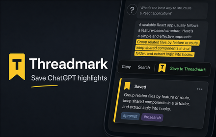

# Threadmark



Threadmark is a Chrome extension designed for power users of ChatGPT. It allows you to highlight, bookmark, and organize specific snippets of text within your ChatGPT conversations, creating a local "clipbook" of your most valuable AI interactions.

[Threadmark on Chrome Web Store](https://chromewebstore.google.com/detail/threadmark/klimdfofgoajhbohddeaigbelapjgkom)

## 📖 Overview

ChatGPT conversations can become long and unwieldy. Finding that *one* specific code snippet or explanation from three weeks ago often involves scrolling endlessly or relying on imprecise browser history.

**Threadmark solves this by letting you:**
1.  **Capture:** Highlight any text in a ChatGPT conversation and save it with a single click.
2.  **Annotate:** Add tags and notes to your bookmarks.
3.  **Re-anchor:** Click a bookmark to instantly open the original chat and scroll to the exact position of the text, even if the chat uses lazy-loading.
4.  **Review:** Browse and search your clipbook via a dedicated Side Panel.

## ✨ Key Features

*   **Zero-Friction Capture:** Select text -> Click Bookmark.
*   **Robust Anchoring:** Uses fuzzy matching and DOM anchoring to find your text even if the chat content has shifted slightly.
*   **Local-First:** All data is stored locally in your browser using IndexedDB. No data is sent to external servers.
*   **Side Panel Manager:** robust search and filtering capabilities right alongside your chat.
*   **Privacy Focused:** Minimal permissions, works only on `chatgpt.com`.

## 🛠️ Development

This project is built with [Bun](https://bun.sh), [TypeScript](https://www.typescriptlang.org/), and [Biome](https://biomejs.dev/).

### Prerequisites

*   [Bun](https://bun.sh) (v1.0+)
*   Chrome-based browser (Chrome, Brave, Edge, etc.)

### Setup

1.  **Install Dependencies:**
    ```bash
    bun install
    ```

2.  **Build the Extension:**
    ```bash
    bun run build
    ```
    The output will be generated in the `dist/` directory.

3.  **Watch Mode (for development):**
    ```bash
    bun run dev
    ```
    This will watch for file changes and rebuild automatically.

### Loading into Chrome

1.  Open Chrome and navigate to `chrome://extensions`.
2.  Enable **"Developer mode"** in the top-right corner.
3.  Click **"Load unpacked"**.
4.  Select the `dist/` directory created by the build step.

## 📂 Project Structure

```
/
├── assets/           # Static assets (icons, store images)
├── dist/             # Compiled extension output
├── docs/             # Documentation (PRD, schema, plans)
├── scripts/          # Build and utility scripts
├── src/
│   ├── background.ts # Service worker (orchestration)
│   ├── manifest.json # Extension manifest
│   ├── features/
│   │   ├── capture/  # Content scripts for capturing text
│   │   ├── sidepanel/# Side panel UI logic
│   │   └── settings/ # Options page logic
│   └── shared/       # Shared utilities and DB access
└── ...
```

## 📄 License

See [LICENSE](LICENSE).
